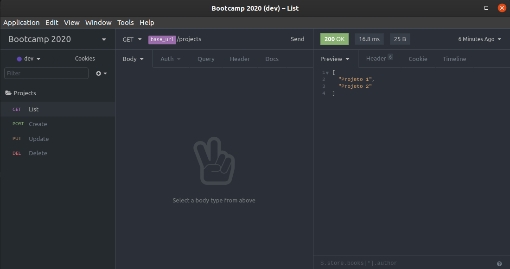

# Insomnia

O [Insomnia](https://insomnia.rest/) é o programa que vamos utilizar para testar nossas API's [ Lembrando que este software é feito com JS + Electron e só funciona em sistemas 64bits ] 

Utilize facilitadores como o Enviroments para criar variaveis que podem ser reaproveitadas neste processo. Para mais informações veja aqui:

[https://www.youtube.com/watch?v=3tB0uDliS6Y](https://www.youtube.com/watch?v=3tB0uDliS6Y)